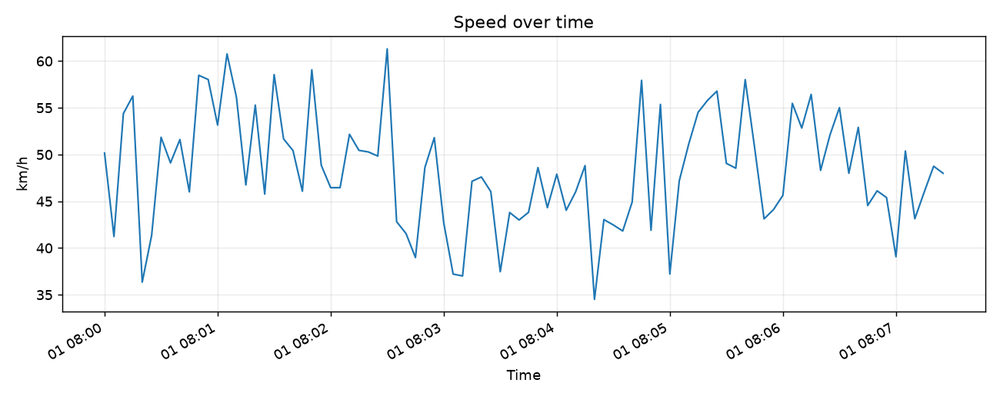
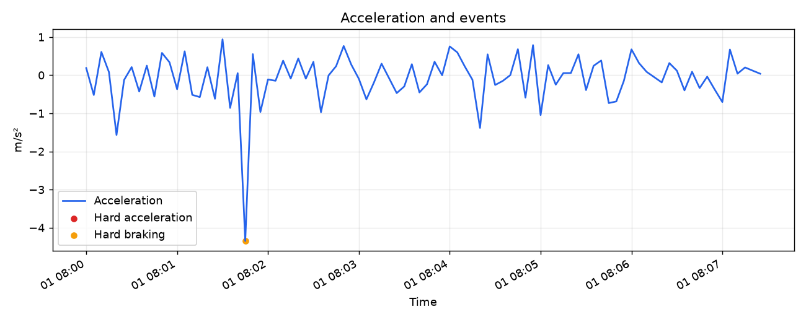
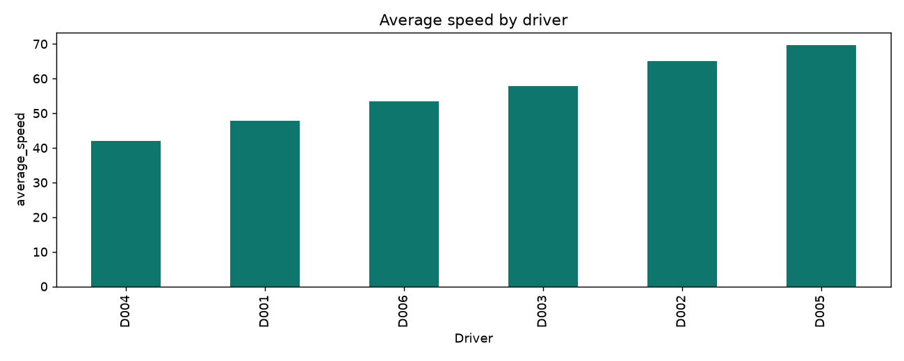
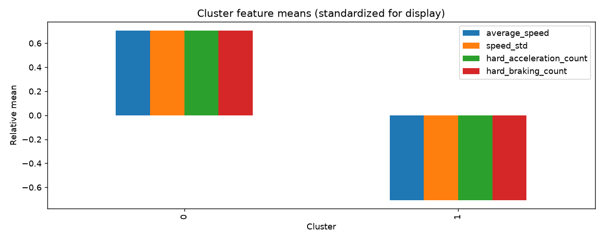
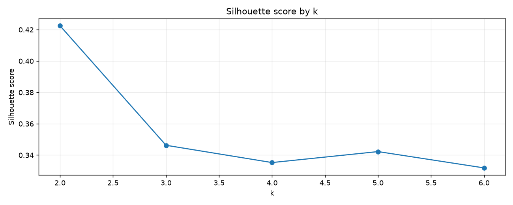

# 자동차 AX 기반 지능형 운전 패턴 분석 시스템

차량 주행 데이터에서 속도·가속도·RPM 특성을 분석하고, 급가속·급감속·과속 이벤트를 표시한 뒤 KMeans로 유사한 주행 패턴을 묶어 Streamlit 대시보드에서 확인하는 교육용 MVP입니다.

## 프로젝트 목적

- pandas 기반 차량 데이터 전처리
- 이벤트 탐지와 주행 단위 Feature Engineering
- StandardScaler와 KMeans를 이용한 비지도 패턴 탐색
- silhouette score를 이용한 후보 군집 수 비교
- matplotlib 시각화와 Streamlit 대시보드 구현

## 프로젝트 구조

```text
driving-pattern-analysis/
├── data/raw/driving_data.csv            # 생성된 입력 주행 데이터
├── data/processed/                      # 주행 이벤트 및 Feature
├── src/                                  # 전처리, 탐지, 분석, 시각화 모듈
├── models/                               # KMeans와 StandardScaler 저장 파일
├── dashboard/app.py                      # Streamlit 앱
├── notebooks/analysis.ipynb              # 선택적 탐색 노트북 위치
├── results/figures/                      # 분석 그래프
├── results/cluster_result.csv            # 주행별 Feature 및 군집
├── generate_sample_data.py
├── run_pipeline.py
└── requirements.txt
```

## 데이터 설명

| 컬럼 | 설명 |
|---|---|
| `driver_id` | 운전자 식별자 (예: D001) |
| `trip_id` | 주행 식별자 (예: T001) |
| `timestamp` | 측정 시각 |
| `speed` | 속도 (km/h) |
| `acceleration` | 종방향 가속도 (m/s²) |
| `brake` | 브레이크 입력 (0/1) |
| `rpm` | 엔진 회전수 |
| `steering_angle` | 조향각 |
| `latitude`, `longitude` | GPS 위도와 경도 |

기본 입력 파일은 `data/raw/driving_data.csv`입니다. 생성기는 고정 seed를 사용해 6명의 운전자와 운전자별 4개 주행 기록을 만듭니다. 생성 과정의 주행 특성 설정은 데이터 변화에만 쓰며 KMeans 입력 Label로 쓰지 않습니다.

## 설치 및 실행

Python 3.10 이상을 권장합니다.

```bash
python -m venv .venv
source .venv/bin/activate       # Windows PowerShell: .venv\Scripts\Activate.ps1
pip install -r requirements.txt
python generate_sample_data.py
python run_pipeline.py
streamlit run dashboard/app.py
```

`run_pipeline.py`는 프로젝트 루트 기준 경로를 사용하고 필요한 출력 폴더를 자동으로 만듭니다. 원본 CSV를 직접 가지고 있다면 `data/raw/driving_data.csv`에 두고 파이프라인을 실행하면 됩니다.

## 샘플 분석 결과

포함된 가상 데이터는 6명의 운전자와 24개 주행 기록으로 구성됩니다. 실행 예시에서는 silhouette score 비교 결과 `k=2`가 선택됐으며, 점수는 `0.4225`였습니다. 이 값은 해당 샘플 데이터에서의 군집 분리 정도를 나타내며, 실제 운전자나 다른 데이터에 대한 성능을 보장하지 않습니다.

### 주행 시계열





### 운전자 및 군집 비교







## 분석 흐름

```text
Vehicle Data → Preprocessing → Driving Event Detection → Feature Engineering
→ StandardScaler → KMeans → Cluster Analysis → Streamlit Dashboard
```

전처리 함수는 원본 DataFrame을 직접 바꾸지 않습니다. 중복 제거, 필수 값 점검, 시간 및 숫자형 변환, 물리 범위를 벗어난 속도/RPM 보정, 주행별 시간 정렬을 수행합니다. 출력으로 `data/processed/driving_events.csv`, `data/processed/driving_features.csv`, `results/cluster_result.csv`, 군집 요약, 모델과 그래프를 생성합니다.

## KMeans와 결과 해석

정답 Label이 없는 환경에서 주행 Feature가 비슷한 기록끼리 탐색하기 위해 비지도학습 KMeans를 사용합니다. 운전자/주행 ID는 모델 입력에서 제외하고, 선택한 수치 Feature에 StandardScaler를 적용합니다. 2부터 최대 6까지의 후보 k를 silhouette score로 비교해 점수가 가장 높은 모델을 선택합니다. 유효 표본이 부족하면 단일 군집 결과를 반환해 파이프라인이 계속 동작합니다.

KMeans의 cluster 번호는 임의의 식별자이며 안전/위험 순위가 아닙니다. 대시보드는 속도 변동 및 이벤트 비율의 군집 평균을 비교해 상대적인 주행 특성을 설명합니다. 개인의 운전 안전성을 확정하거나 평가하지 않습니다.

급가속(2.5 m/s²), 급감속(-3.0 m/s²), 과속(100 km/h) 임계값은 이 교육용 프로젝트에서 사용하는 **예시 분석 기준**입니다. 실제 교통법규, 도로별 제한속도 또는 안전성 판단 기준이 아닙니다. 분석 결과를 실제 운전 판단에 사용하지 마세요.

## 14일 개발 일정

| 날짜 | 작업 |
|---|---|
| Day 1 | 목표 정의, 저장소와 폴더 구조 생성 |
| Day 2 | 가상 차량 주행 데이터 생성 |
| Day 3 | 데이터 탐색 및 EDA |
| Day 4 | 데이터 전처리 구현 |
| Day 5 | 속도·가속도 기본 분석 |
| Day 6 | 급가속·급감속·과속 탐지 |
| Day 7 | Feature Engineering |
| Day 8 | 데이터 시각화 |
| Day 9 | StandardScaler와 KMeans 구현 |
| Day 10 | silhouette score 및 군집 분석 |
| Day 11 | Streamlit 기본 Dashboard |
| Day 12 | 대시보드와 분석 결과 연결 |
| Day 13 | 전체 파이프라인 실행 및 오류 수정 |
| Day 14 | 문서와 결과 정리, 포트폴리오 준비 |

## 향후 개선 (Future Work)

- 실제 OBD-II 데이터 연동
- CAN 데이터 활용
- GPS 기반 도로 분석 및 제한속도 데이터 연동
- 운전자별 장기간 패턴 분석
- 설명 가능한 운전 피드백 모델
- 이상 탐지 모델, 지도 기반 시각화, 실시간 데이터 처리

향후 차량 데이터 연결 구상:

```text
Vehicle
   ↓
OBD-II / CAN
   ↓
Real-time Data Collection
   ↓
Driving Feature Extraction
   ↓
AI Driving Pattern Analysis
   ↓
Driver Feedback
```

## 파일 크기 관리

샘플 CSV와 joblib 모델은 현재 교육용 소규모 파일입니다. 실제 데이터를 사용해 파일이 커지면 `.gitignore`에 `data/raw/*.csv`, `models/*.pkl`을 추가해 저장소에서 제외할 수 있습니다. 개인 식별 정보나 실제 차량 원시 데이터를 공개 저장소에 올리지 마세요.
